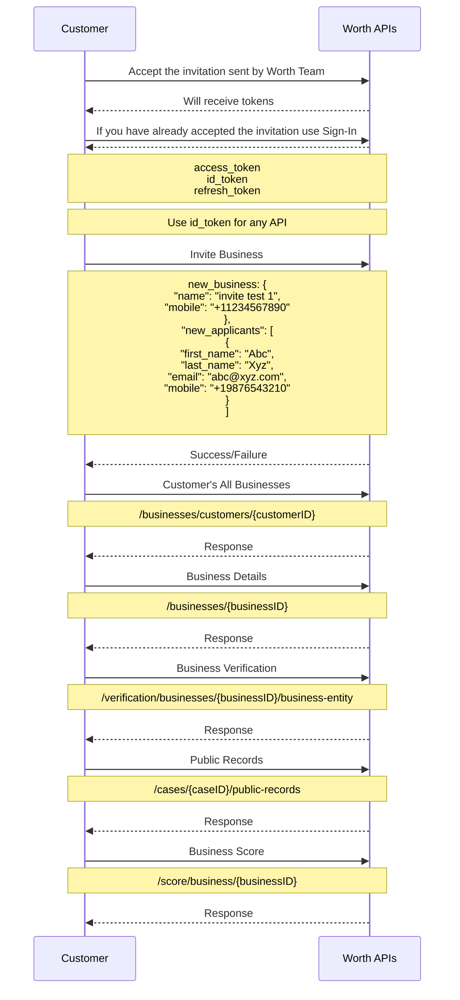

This sequence diagram demonstrates the efficient business onboarding process facilitated by Worth UI, where invitations are sent to businesses, guiding them through a seamless registration and onboarding experience via the platform.

---


## **Process breakdown**

### **1. Onboarding API calls**

- **Authentication**:  
  Upon accepting initial invitation or signing in, the customer receives the following tokens:
  - **access token**: used for purposes like logout, update password etc.
  - **id token**: used for secure api communication. (**recommended for all api calls.**)
  - **refresh token**: to renew Access and ID token.

  **Note**: always use the **id token** for secure api communication.  see [this page](https://docs.worthai.com/api-reference/auth/sign-in/customer-sign-in) for more info.

- **Invite Business**:  
  The customer provides business information in the following structure:
  ```json
    {
        "business": {
            "name": "Business Name",
            "mobile": "+11234567890"
        },
        "applicants": [
            {
                "first_name": "Abc",
                "last_name": "Xyz",
                "email": "abc@xyz.com",
                "mobile": "+19876543210"
            }
        ]
    }
  ```

  This triggers email to applicant to complete the onboarding process. See [Invite Business documentation](http://docs.worthai.com/api-reference/auth/invites/invite-business) for further information.

---

### **2. Worth AI System Actions**
Upon sending invite, an email with invite link will be sent to the applicant on the email provide. Once the applicant submitted the onboarding you can retrieve the business information using this [APIs](https://docs.worthai.com/use-cases/onboarding/instant-onboarding#3-retrieve-data).

Also you can use [webhooks](https://docs.worthai.com/webhooks/business) to get the business status and information.

---

### **3. Retrieve Data**
To fetch all businesses:
- **Fetch all business**:
  Retrieves all businesses information
  **API Endpoint**: [`/businesses/customers/{customerID}`](https://docs.worthai.com/api-reference/case/businesses/get-customer-businesses)

The following endpoints allow you to fetch data for a specific business:
- **Fetch business data**:  
  Retrieves detailed infromation about a specific busienss by its unique ID.  
  **API Endpoint**: [`/businesses/{businessID}`](https://docs.worthai.com/api-reference/case/businesses/get-business-by-id)

- **Fetching Public Records**:  
  Retrieves relevant public records found that are associated with the business.  
  **API Endpoint**: [`/cases/{caseID}/public-records`](https://docs.worthai.com/api-reference/integration/public-records/public-records)

- **Business Verification**:  
  Retrieves business details such as legal standing and ownership information when available.
  **API Endpoint**: [`/verification/businesses/{businessID}/business-entity`](https://docs.worthai.com/api-reference/integration/verification/get-verification-details)

- **Fetching Website Metadata**:  
  Gathers metadata from the business's official website if provided.

- **Business Scoring**:  
  Retrieves the calculated business score.  
  **API Endpoint**: [`/score/businesses/{businessID}`](https://docs.worthai.com/api-reference/scoring/)

---


**Send invitation to business and let them onboard using Worth UI!!**

<br />


